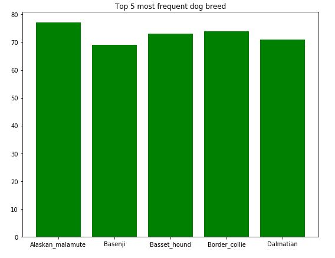
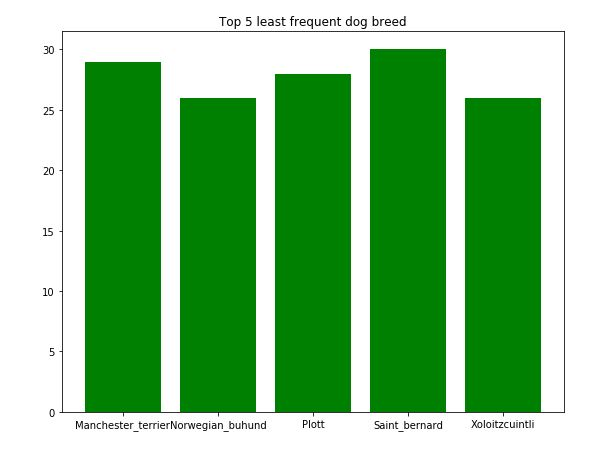
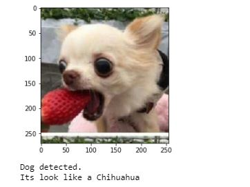
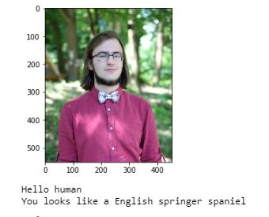
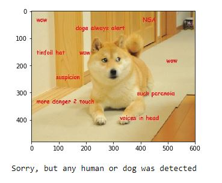

# Machine Learning Engineer Nanodegree
## Capstone Project
Volodymyr Mudryi  
May 29st, 2020

## I. Definition

### Project Overview
Today machine learning can solve a large amount of tasks, so i decided to classie a dog breed by photo.
The result of this project is App to classie a dog bredd by the photo, in case if there human instead of dog on image app will return the dog breed which is the most similar to that human. Th

### Problem Statement
The goal is to create a pipeline with dog detector on photo, if there any dogs a human face detector should run and after that a CNN should take a photo and return a correct dog breed for dogs pictures and most similar dog breed for human pictures.

In this task i implemented 2 CNN models, first one is created from scratch (used like a benchmark) and second one is based on transfer learning aproach.

### Metrics
This is a classification task with a lot of classes, so a common approach will be to use multi-class log loss metrics to model evaluation.

For human photos there is not any metrics because we dont have a correct labels, so the only metric here is human base evaluation (ask some group of pepole) 

## II. Analysis

### Data Exploration

Dataset for this task was provided by Udacity, so there are a human photos folder and dog photos folder. All photos was labeled by correct dog breed (class).

- For human pictures we got 13233 images without any splits because we use it only for test pre-trained models and wouldn’t train any human recognition algorithm. Therefore, all human pictures are the same size (250×250)

 - For dogs pictures we got 8351 splited into a three folders: train (6,680 Images), test (836 Images) and valid (835 Images) which divided by folders by dog breeds (133 folders in all splits). All this pictures have different sizes, lightning, backgrounds and dog position so it will help to build more robust algorithm.

Dog pictures example:

 | 

### Exploratory Visualization
For this task there isnt many posibile explonatory visualization because all the data are in photos, but i think that could be usefull to look at top 5 most frequent and least frequent dog breeds in train data

 
 

As we can see there is disbalance in data because the most frequent dog breed are:
- Basenji apearce 69 times
- Dalmatian apearce 71 times
- Basset_hound apearce 73 times
- Border_collie apearce 74 times
- Alaskan_malamute apearce 77 times

And the least frequent apearce almost half that much:
- Norwegian_buhund apearce 26 times
- Xoloitzcuintli apearce 26 times
- Plott apearce 28 times
- Manchester_terrier apearce 29 times
- Saint_bernard apearce 30 times

So its should be carefull to detect all the small size classes.

### Algorithms and Techniques
I used a CNN architecture because its the best aproach when you want to work with images, because it can extract features from images very efectivly. On top of it i use a few fully conected layers for clasification itself. I also add some sort of regularization with data augmentation and Dropout layers. But in fact, the CNN networks need a lot of data to train efectivly so it would be posible to train it from zero with provided amount of data.

Next step was to use a transfer learning, it provide a pretrained CNN part (feature extracting) so only aa classifier part is training, so with this aproach result should be much better. 

### Benchmark
First benchmark was a random guess, even with high data duisbalance this aproach could give an accuracy score less than 1%.
Next step was to provide a model from sctratch and achive atleast 10% of accuracy. After that we can use it as a benchmark.

And for final transfer learning aproach we should beat a scratch model and achive accuracy score more than 60%.

## III. Methodology

### Human face detector
For human face detector i used an OpenCv aproach with Haar feature-based cascade classifiers. In data preprocesing step image got grayscaled and after that a simple CascadeClassifier detect faces on image and return number boolean variable if that any faces on image.

### Human face detector
For dog detector i used a pre-trined VGG-16 Model. This model trained on ImageNet (huge image dataset). In data preprocesing step image got resized to be 224x224 and after that normalize with following parameters:  mean=[0.485, 0.456, 0.406], std=[0.229, 0.224, 0.225]. Then a model clasiifie the image and return a number, one of 1000 posible classes. In our task we need only need dogs, so in that case we should  label as a dog all classes that related to different dog breeds (158-268).

### Dog breed clasifier
Training of CNN for dog breed classification.

#### Data Preprocessing
For data preprocessing i used a following steps: resize to 256x256 (because its a common size for CNN models) add a RandomHorizontalFlip for data augmentation (only for train dataset) and normalize image with following parameters mean=[0.485, 0.456, 0.406], std=[0.229, 0.224, 0.225].

#### CNN from scratch
For this task i decided to recreate a famous AlexNet architecture, so i end up with this layers:
  - (conv1): Conv2d(3, 64, kernel_size=(11, 11), stride=(4, 4), padding=(2, 2))
  - (conv2): Conv2d(64, 192, kernel_size=(5, 5), stride=(1, 1), padding=(1, 1))
  - (conv3): Conv2d(192, 384, kernel_size=(3, 3), stride=(1, 1), padding=(1, 1))
  - (conv4): Conv2d(384, 256, kernel_size=(3, 3), stride=(1, 1), padding=(1, 1))
  - (conv5): Conv2d(256, 256, kernel_size=(3, 3), stride=(1, 1), padding=(1, 1))
  - (pool): MaxPool2d(kernel_size=3, stride=2, padding=0, dilation=1, ceil_mode=False)
  - (fc1): Linear(in_features=50176, out_features=4096, bias=True)
  - (fc2): Linear(in_features=4096, out_features=4096, bias=True)
  - (fc3): Linear(in_features=4096, out_features=133, bias=True)
  - (dropout): Dropout(p=0.5)
 
For loss i use CrossEntropyLoss and as optimizer i use SGD (Gradient descent (with momentum)) with learning rate equal to 0.05 and train model for 25 epochs with batch size equal to 32.

#### Transfer learning
For transfer learning i decide to use a ResNet101 pre-trainde model. I choose ResNet because its like one of the best models architecture for image classification and I often see mention of this architecture in many Kaggle competitions and articles (mainly because of skip-connections). 
Also, its main improvement of this step it's not in architecture its more in parameters that trained on a large dataset. So with this pre-trained model for features extracting I change a fully connected layer on top to be suitable for my task (133 class outputs).

For loss i use CrossEntropyLoss and as optimizer i use SGD (Gradient descent (with momentum)) with learning rate equal to 0.001 and train model for 15 epochs with batch size equal to 32.

## IV. Results

### Model Evaluation and Validation
In the end final model achive a accuracy score 87% what it good results, but not the best one there are still a lot of improvements but all of them its not clearly its more like a more parameters to be amalise but in general model perfom pretty good, i upload a 3 dog photos and 2 of them are corrctly labeled and the one not recognize dog on it, so there should be a lot of work to improve a dog recognition algotrithm to make it more robust. Also i think with more time and more data it model can achive a better results.

Also the model from scratch achive 11% of accuracy which is low resulttm but for me main porpose was to build this model because my main goal was to learn how to develop such a models. 

So in conclusion it think model perform good enoeght with this amount od data (less than 60 photos per class in average) so with more data it could be improved, but main improvement should come from dog detector algorithm. Also with more data we can train model formore epochs because on small dataset model easely overfit.

### Justification
In the end this model achived CrossEntropyLoss equal to 0.68 and accuracy equal to 87% its good result for me, but in compare with same competition on Kaggle where top result for loss are equal to 0 its pretty bad. But on Kaggle there was dataset 3 times bigger so in furture i think i will try to use my models with that dataset.

Also the part about human its pretty fun, with human evaluation from my friends its look like everythin work fine (fine enought to make some fun) so in generall conclusion this project results not the best but its good enought with such dataset and such model training enviroment.

## V. Conclusion

### Free-Form Visualization
In this section i provide a example result of the model output:

The correct results of algorithm:
 
 

The bad results (error in dog detector model)
 

### Reflection
For me this project was really intersting because i learn a lot of new stuff about data loaders, can wrote my own implementation of famous architecture and make it work and combine few model to make a final result as an app. Also was interesting to tune different parameters and look how the loss go down or up with different sets of parameters.

For me some difficults was in summarize all the results, like make a github pero with all the stuff, wrote this report also take me a long time and power.

In future i have some thinks how to transform this model and improve result to build a funny app where you can recognize dogs from memes and find most similar dog photo to you.

### Improvement
In generall results is pretty good, but there is some steps to improve the app pipeline:
- Add more data augmentation (rotation, blur, cropping) and more data
- Choose the best model parameters and maybe train with that parameters a bit more time
- Use better human face and dog detectors, because there was a photo where dog is not detected

Also i think a posible improvvements of project in general:
- Show top n dog breed for prediction, so user can choose between 3-4 breed the best one
- For human its looks cool to show a picture of that breed so it may be implemented a similarity searching betwen human photo and dogs photo of that breed

